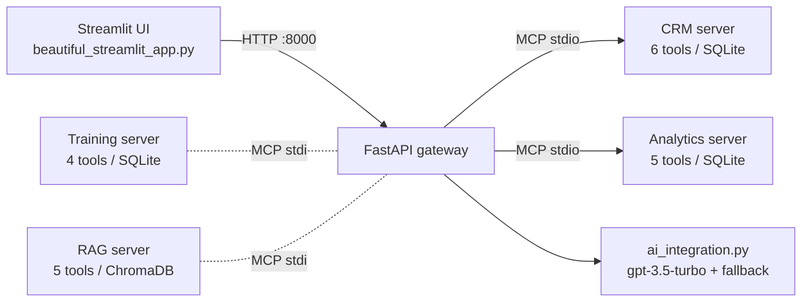

# MCP Sales Enablement

A demonstration platform that exposes CRM, analytics, RAG, and training-pipeline capabilities as Model Context Protocol (MCP) servers behind a FastAPI gateway, with a Streamlit front end for sales teams.

It shows how a sales-assistant product can be decomposed into independent MCP tool servers — account/deal management, forecasting and deal scoring, vector retrieval over call transcripts, and a feedback-driven entity-extraction pipeline — orchestrated over stdio by a single HTTP gateway. It is a demo: several surfaces intentionally serve mock data so the UI can be exercised end to end without external services.

## Architecture at a glance

- **Orchestration pattern:** gateway-mediated tool federation. A FastAPI HTTP gateway is the single entry point; it spawns MCP servers as stdio subprocesses and forwards requests as MCP tool calls. Composite reads in `client/mcp_client.py` (e.g. `get_account_360`, `get_pipeline_dashboard`) chain CRM and Analytics tool calls **sequentially** — there is no parallel fan-out and no autonomous agent loop; every LLM interaction is a single request/response.
- **Models:** OpenAI `gpt-3.5-turbo` via `ai_integration.py` for chat, transcript analysis, and email drafting, with a deterministic keyword-based fallback when no API key is configured or a call fails. Embeddings use SentenceTransformers `all-MiniLM-L6-v2`.
- **Memory / state:** SQLite databases (`data/sales_crm.db` shared by the CRM and Analytics servers; `training_data.db` for the training pipeline). No conversational session store — chat requests are stateless.
- **Retrieval:** ChromaDB (persistent, `./chroma_db`) with three collections — `transcripts`, `deals`, `knowledge` — queried by embedding similarity in `rag_server.py`. Retrieval confidence feeds a progressive-autonomy gate (auto-execute ≥ 0.90, suggest-with-review ≥ 0.70, human-required below).



Solid lines are the wiring in `api/api_gateway.py`; dashed servers are implemented but not spawned by either committed gateway (see [docs/ARCHITECTURE.md](docs/ARCHITECTURE.md)).

Two gateway variants are committed:

| File | Role |
|---|---|
| `api/api_gateway.py` | Real MCP wiring: connects to the CRM and Analytics servers over stdio at startup |
| `api_gateway_quick_fix.py` | Self-contained demo gateway serving mock data for every endpoint (what the quickstart runs) |

## Quickstart

Requires Python ≥ 3.10 and [uv](https://docs.astral.sh/uv/).

```bash
git clone https://github.com/git-bonda108/mcp-sales-enablement.git
cd mcp-sales-enablement
uv sync

# Terminal 1 — backend (mock-data demo gateway)
uv run python api_gateway_quick_fix.py
# expected: "🚀 Starting Quick Fix API Gateway on http://localhost:8000"

# Terminal 2 — frontend
uv run streamlit run beautiful_streamlit_app.py --server.port 8502
# expected: "You can now view your Streamlit app in your browser. Local URL: http://localhost:8502"
```

Verify:

```bash
curl http://localhost:8000/health
# {"status":"healthy","timestamp":"..."}
curl http://localhost:8000/api/metrics
curl http://localhost:8000/crm/accounts
```

Individual MCP servers can be run and smoke-tested directly:

```bash
uv run python -m servers.crm_server        # prints its 6 tools, then waits for an MCP client
uv run python tests/working_crm_test.py    # spawns the server and exercises the tool logic
```

## Configuration

| Variable / file | What it is | Where to get it |
|---|---|---|
| `OPENAI_API_KEY` | Enables real LLM responses in `ai_integration.py` (loaded via `.env` / environment). Without it the platform runs in deterministic fallback mode. | platform.openai.com |
| `credentials.json` | Google OAuth client secrets for the Gmail integration (`gmail_client.py`, `gmail_integration.py`). Git-ignored; place in the repo root. | Google Cloud Console → APIs & Services → Credentials (OAuth client, Desktop app) |
| `token.pickle` / `token.json` | Cached Gmail OAuth token, created on first authentication. Git-ignored. | Generated automatically |
| `docker-compose.yml` env (`DATABASE_URL`, `REDIS_URL`, `MODEL_SERVER_URL`, …) | Part of a containerized deployment sketch; the referenced build contexts are not in this repo. | See [docs/HARDENING.md](docs/HARDENING.md) |

## Documentation

- [docs/ARCHITECTURE.md](docs/ARCHITECTURE.md) — component map, data flow, orchestration analysis, design trade-offs
- [docs/EVALUATION.md](docs/EVALUATION.md) — what is actually tested today, and a proposed evaluation harness
- [docs/HARDENING.md](docs/HARDENING.md) — current security posture and a staged path to production
- [docs/MCP_CONCEPTS.md](docs/MCP_CONCEPTS.md) — background notes on MCP concepts used here

## Repository layout notes

- `servers/`, `client/`, `config/`, `data/` hold the canonical packaged modules; byte-identical copies of several of them exist at the repository root (and in `src/`) so flat-import deployment targets such as Streamlit Cloud can run the app without package installation.
- The numerous `BATCH*`, `*_SUMMARY.md`, and `*_REPORT.md` files are working notes retained from the iterative build; the four documents above supersede them as reference documentation.

## Status

Demonstration project. The UI, gateway, MCP servers, RAG store, and training pipeline are all implemented, but the quickstart path serves mock data by design, and the LLM layer degrades to canned responses without an API key. See [docs/EVALUATION.md](docs/EVALUATION.md) for an honest account of test coverage and known gaps.
