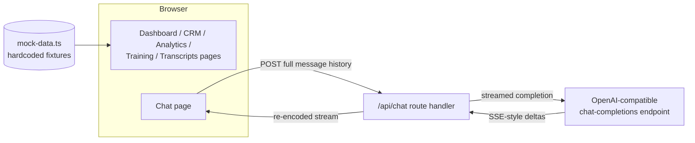

# Sales Enablement Dashboard

A sales-enablement dashboard prototype: a Next.js 14 (App Router) web application with pages for pipeline analytics, CRM contact views, call-transcript review, and training-pipeline monitoring, plus a streaming AI sales-assistant chat backed by a single server-side API route.

## What this is (and is not)

This repository contains a **front-end prototype**. Every dashboard, chart, contact list, and transcript is rendered from a hardcoded mock-data module (`app/lib/mock-data.ts`). The one live integration is the chat page: `app/app/api/chat/route.ts` proxies the conversation to an OpenAI-compatible chat-completions endpoint and streams the reply back to the browser. There is no database, no authentication, no CRM connection, and no test suite.

The `docs/` directory also contains a set of **design specifications** (voice gateway, CRM sync, training pipeline, and others) describing a much larger target system. Those documents are forward-looking design work; the components they describe are **not implemented in this codebase**. The engineering documents below are the accurate description of what is actually here.

- [Architecture](./docs/ARCHITECTURE.md) — component map, data flow, and design analysis of the real code
- [Evaluation](./docs/EVALUATION.md) — current test coverage (none) and a proposed evaluation harness
- [Hardening](./docs/HARDENING.md) — security posture and a staged path to production

## Architecture at a glance

- **Orchestration pattern**: single-agent, single-turn streaming proxy. There is no agent framework, no tool calling, no retrieval, and no multi-step orchestration. Each chat request is one sequential pipeline: browser → Next.js route handler → upstream chat-completions API → re-encoded server-sent-event stream → browser.
- **Model**: `gpt-4.1-mini`, hardcoded in the route handler, called through an OpenAI-compatible endpoint (`apps.abacus.ai/v1/chat/completions`) with `stream: true`, `max_tokens: 3000`, `temperature: 0.7`.
- **Memory / session state**: none on the server. Conversation history lives in React component state and the full history is replayed to the model on every request. Refreshing the page discards the conversation.
- **Retrieval**: none. The system prompt is a static string; the assistant is not grounded in the dashboard's data.



## Quickstart

Prerequisites: Node.js 18+.

```bash
git clone https://github.com/git-bonda108/sales-enablement-dashboard.git
cd sales-enablement-dashboard/app
corepack enable          # activates the yarn version pinned in package.json (yarn 4.9.2)
yarn install
```

Note: `app/package.json` declares dependencies but **no `scripts` block**, so `npm run dev` / `yarn dev` will fail with "missing script". Invoke Next.js directly:

```bash
yarn next dev
```

Expected output:

```
  ▲ Next.js 14.2.28
  - Local:        http://localhost:3000
 ✓ Ready in ...
```

All pages render immediately from mock data. The chat page additionally needs an API key — without it, sending a message returns the UI's fixed error reply ("Sorry, I encountered an error. Please try again."):

```bash
echo 'ABACUSAI_API_KEY=<your key>' > .env.local   # inside app/
yarn next dev
```

## Configuration

| Variable | Read by | What it is | Where to get it |
|---|---|---|---|
| `ABACUSAI_API_KEY` | `app/app/api/chat/route.ts` | Bearer token for the OpenAI-compatible chat-completions endpoint the chat route proxies to | The endpoint provider's account dashboard |

This is the **only** environment variable the code reads. The root `.env.example` lists many additional variables (database, CRM, email, payments, and more); those belong to the planned system described in the design specs and are not consumed by the current code.

## Repository layout

| Path | Contents |
|---|---|
| `app/` | The Next.js application (pages, components, mock data, the chat API route) |
| `docs/ARCHITECTURE.md`, `docs/EVALUATION.md`, `docs/HARDENING.md` | Engineering documentation for the code as it exists |
| `docs/*.md` (voice gateway, CRM integrations, training pipeline, AI/ML architecture, Gmail integration, monitoring) | Design specifications for the target system — not implemented here |
| `architecture.md`, `technical_writeup.md`, `training_pipeline.md`, `PROJECT_DOCUMENTATION.md` | Earlier root-level design writeups for the target system (the full design-spec set, including PDF exports, lives in `docs/`) |
| `VERCEL_DEPLOYMENT.md` | Vercel deployment walkthrough for the `app/` application |
| `demo/` | An abandoned partial scaffold (configs and an older copy of the mock-data module; no pages, no `package.json`) — it does not build and nothing references it |

## Known gaps

Documented in detail in [EVALUATION](./docs/EVALUATION.md) and [HARDENING](./docs/HARDENING.md):

- No automated tests, linting gate, or CI anywhere in the repository.
- All product data is static mock data; the training "start" button and transcript "upload" flow are simulated in the UI.
- The chat API route is unauthenticated and has no timeout, retry, or rate limiting.
- Build artifacts (`app/.next/`, `app/tsconfig.tsbuildinfo`) are committed to version control.

## License

No license file is present in this repository. All rights reserved by default; open an issue if you need clarification before reuse.
